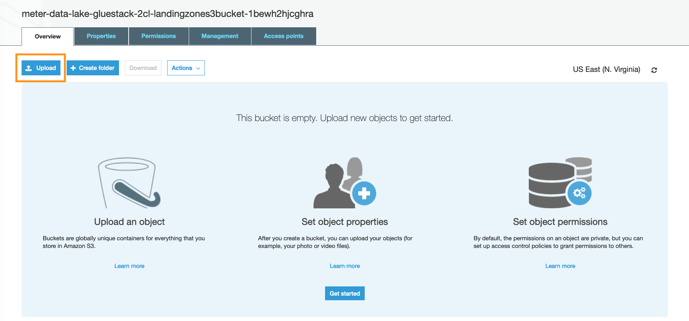
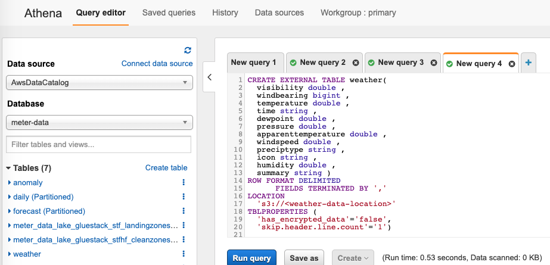
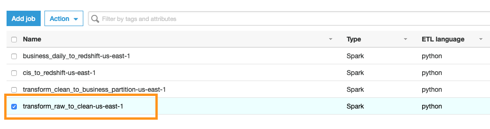

// Add steps as necessary for accessing the software, post-configuration, and testing. Don’t include full usage instructions for your software, but add links to your product documentation for that information.
//Should any sections not be applicable, remove them

== Post-deployment steps

To see the capabilities of the QuickStart, follow the steps in this section to use the dataset of meter reads from the City of London between 2011 and 2014. The <<Customize this Quick Start>> section explains how to edit the raw-data ETL script to work with your own meter data.

=== Download sample dataset
Download the sample dataset https://data.london.gov.uk/dataset/smartmeter-energy-use-data-in-london-households[here^]. You could download the file to your local machine, unzip it, and then upload it to Amazon S3. However, given the size of the unzipped file (~11GB), it's faster to run an EC2 instance with sufficient privileges to write to Amazon S3, download the file to the EC2 instance, unzip it, and upload the data from there.

https://data.london.gov.uk/download/smartmeter-energy-use-data-in-london-households/3527bf39-d93e-4071-8451-df2ade1ea4f2/Power-Networks-LCL-June2015(withAcornGps).zip[Download sample meter data^]

=== Upload the dataset to the landing-zone (raw-data) S3 bucket
You must upload the sample dataset to the landing-zone (raw-data) S3 bucket. The landing zone is the starting point for the AWS Glue workflow. Files that are placed in this S3 bucket will be processed by the ETL pipeline. Furthermore, the AWS Glue ETL workflow tracks which files haven been processed and which have not.

To upload the sample dataset to the landing-zone S3 bucket, follow these steps:

. Select the landing-zone bucket. Bucket names are generated. Find the name that contains "landingzones." This will be the starting point for the ETL process.
+
:xrefstyle: short
[#bucket_layout]
.S3 bucket layout
image::../images/1_bucket_layout.png[Bucket Layout]

. Upload the London meter data to the landing-zone bucket.
+
:xrefstyle: short
[#upload_demo_dataset]
.Upload demo dataset


. After the demo data is uploaded, verify that the folder contains one file with all the meter reads.
+
:xrefstyle: short
[#uploaded_demo_dataset]
.Uploaded demo dataset
image::../images/3_upload_demo_data_set.png[Uploaded demo dataset]

WARNING: The landing-zone S3 bucket should only have meter-data files. If it contains any subfolders, the ETL workflow will fail.

//TODO Shivansh, What should people do if they see subfolders? Warnings should include guidance.

//[TODO EC2 command line steps]

=== Prepare weather data if you want to use it for training and forecasting

. https://www.kaggle.com/jeanmidev/smart-meters-in-london?select=weather_hourly_darksky.csv[Download^] the sample weather dataset.
. Upload the dataset to the S3 bucket.
. Create a weather table in the target AWS Glue database using the following SQL statement. Replace <weather-data-location> with the location where you upload the weather dataset.
+
:xrefstyle: short
[#create_weather_table]
.Create weather table

+
```sql
CREATE EXTERNAL TABLE weather(
  visibility double,
  windbearing bigint,
  temperature double,
  time string,
  dewpoint double,
  pressure double,
  apparenttemperature double,
  windspeed double,
  preciptype string,
  icon string,
  humidity double,
  summary string )
ROW FORMAT DELIMITED
      FIELDS TERMINATED BY ','
LOCATION
  's3://<weather-data-location>'
TBLPROPERTIES (
  'has_encrypted_data'='false',
  'skip.header.line.count'='1');
```

If you have another weather dataset you want to use, make sure it contains at least the four columns shown in [___].

//TODO Shivansh, how do we fill in the blank in the previous sentence so that it automatically says "Table 1"? Do we need something like what we use for figures — ':xrefstyle: short' — to make sure we generate the number, not the caption text? (Please let me know so that I can fill in table references on my own in the future. Thanks.)

[cols="1,1,1,1", options="header"]
.Weather data schema
|===
|Field
|Type
|Mandatory
|Format
|time|string|X|  yyyy-MM-dd HH:mm:ss
|temperature| double|X|
|apparenttemperature|double|X|
|humidity|double|X|
|===

The CloudFormation parameter `WithWeather` should have been set to 1 to indicate that weather data is available to use for generating the ML model.

=== Prepare geolocation data

This Quick Start requires geolocation data to be uploaded to the `geodata` folder in the business-zone S3 bucket. You can get the name of the this bucket from the output section of the CloudFormation stack. The S3 path of geodata location should be `s3://<business-zone-s3-bucket-name>/geodata/`. The data should be in a .CSV file format with the following structure, where all three columns are mandatory with comma-separated values.

//TODO Shivansh, we say "all three columns," but there are only two.

[cols="1,1", options="header"]
.Geolocation data schema
|===
|Field
|Type
|meter id |string
|latitude |string
|longitude |string
|===

If this data is missing, any API request to get meter-outage information will return an error.


=== Start the AWS Glue ETL and ML training pipeline

By default, the pipeline is configured to be triggered each day at 09:00 and to process the newly arrived data in the landing-zone S3 bucket. To process the uploaded data without waiting, you trigger the ETL pipeline manually. When you do, the AWS Glue workflow orchestrates the steps of the ETL process. Then, the model training state machine is triggered to build the ML model and prepare the data for forecasting energy usage and reporting on anomalies.

To trigger the ETL pipeline manually, follow these steps.

. Go to the AWS Glue console, and choose *Workflows*.
+
:xrefstyle: short
[#glue_console]
.AWS Glue console
image::../images/4_start_etl_workflow.png[AWS Glue Console]

. Select the workflow. 
. On the *Actions* menu, choose *Run*.
+
:xrefstyle: short
[#start_etl_workflow]
.Start ETL workflow
image::../images/5_start_etl_workflow.png[Start ETL workflow]

. In the *History* tab, make sure that the workflow's run status is *Running*.
+
:xrefstyle: short
[#running_workflow]
.Running workflow
image::../images/6_start_etl_workflow.png[Running workflow]

TIP: If the workflow doesn't start and jumps directly to a run status of *Completed*, go back to step 2.

//TODO Shivansh, In the preceding tip, how do we set the step number to automatically track with editing changes in the steps, as we do with figure references? (Please let me know so that I can make these edits myself in the future.)

== Customize this Quick Start

You can customize this Quick Start for use with your own data format. To do that, you adjust the first AWS Glue job to map the incoming data to the internal meter-data-lake schema. The following steps describe how.

The first AWS Glue job in the AWS Glue ETL workflow transforms the raw data in the landing-zone S3 bucket to clean data in the clean-zone S3 bucket. This step is also responsible for mapping the inbound data to the internal data schema, which is used by the rest of the steps in the AWS ETL workflow and the ML step functions.

To update the data mapping, you can edit the AWS Glue job directly in the web editor.

. Navigate to the AWS Glue Job console.
+
:xrefstyle: short
[#glue_job_console]
.AWS Glue Job console
image::../images/1_edit_etl_job.png[AWS Glue Job console]

. Select the `transform_raw_to_clean-*` job.
+
:xrefstyle: short
[#edit_etl_job]
.Edit ETL job


. Open the script editor and start editing the input mapping.
+
:xrefstyle: short
[#open_editor]
.Open the script editor
image::../images/3_open_editor.png[Open the script editor]

. To adopt a different input format, look for the `ApplyMapping` call and adjust it to your needs to reflect your custom input format. The internal model works with the following schema:
+
[cols="1,1,1,1", options="header"]
.Schema
|===
|Field
|Type
|Mandatory
|Format

|meter_id| String| X|
|reading_value| double| X|0.000
|reading_type| String| X|AGG\|INT
|reading_date_time| Timestamp| X|yyyy-MM-dd HH:mm:ss.SSS
|date_str| String|X| yyyyMMdd
|obis_code| String| |
|week_of_year| int| |
|month| int| |
|year| int| |
|hour| int| |
|minute| int| |
|===

include::./ml_pipeline.adoc[]

== Data schema and API I/O format
include::./data_format.adoc[]

== Best practices
Use Amazon S3 Glacier to archive the meter data from raw, clean, and business S3 buckets for long-term storage and cost savings.
