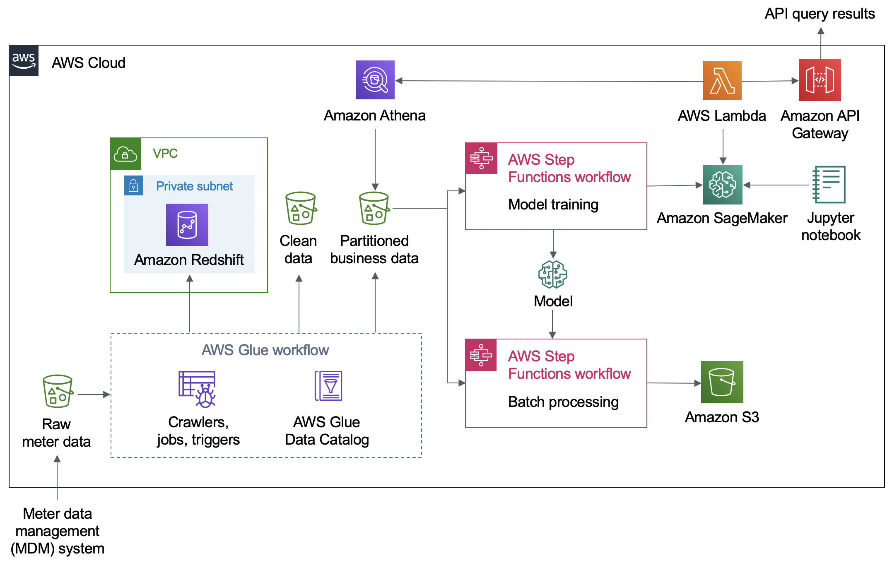

Deploying this Quick Start for a new virtual private cloud (VPC) with
*default parameters* builds the following _{partner-product-name}_ environment in the
AWS Cloud.

:xrefstyle: short
[#architecture1]
.Quick Start architecture for _{partner-product-name}_ on AWS
[link=images/architecture_diagram.png]

As shown in Figure 1, the Quick Start sets up the following:

* AWS S3 buckets to store raw, clean and (partitioned) business meter data. 
** Data in business bucket is partitioned as follows - s3://BusinessBucket/<reading_type_value>/<date>/<meter-data-file-in-parquet-format>
* AWS Glue crawlers, and Glue Jobs to transform crawl, transform and convert incoming raw meter data into cleaned data, in desired format and partitioned appropriately into "curated" business data.
* AWS Glue workflow to orchestrate various triggers, crawlers and jobs.
* AWS Glue data catalog to store metadata and source information about the meter data.
* Amazon Redshift cluster in a private subnet inside a VPC.
* AWS Step function to train model using the partitioned meter data available in business S3 bucket.
* AWS Step function to batch process the meter data for energy usage forecast and anomaly detection.
* Amazon Sagemaker endpoint for real-time inferencing energy usage forecasting.
* Jupyter notebook with sample code to perform data science and data visualization on meter data, directly from AWS S3 buckets.
* AWS Lambda functions to query S3 via Amazon Athena or invoke Amazon Sagemaker endpoint, to provide API query results
* Amazon API Gateway endpoint to get information about energy usage forecast, anomaly detection and meter outage information.
* A VPC configured with public and private subnets, according to AWS best practices, to provide you with your own virtual network on AWS.*

*The template that deploys the Quick Start into an existing VPC skips
the components marked by asterisks and prompts you for your existing VPC
configuration.
