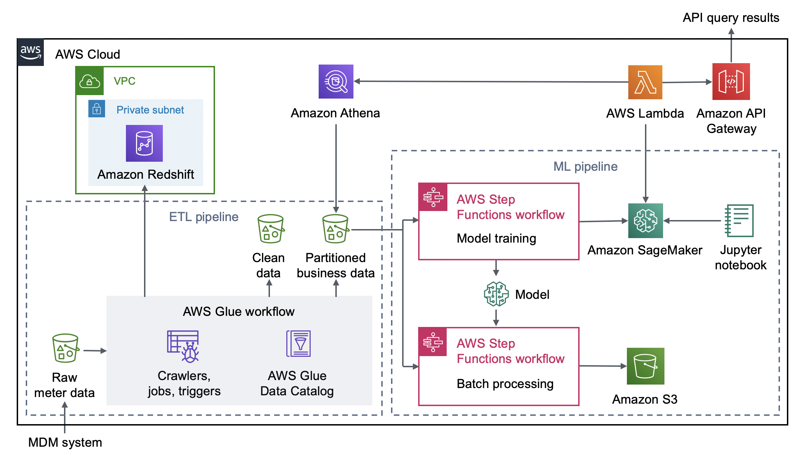

Deploying this Quick Start for a new virtual private cloud (VPC) with
default parameters builds the following _{partner-product-name}_ environment in the
AWS Cloud.

:xrefstyle: short
[#architecture1]
.Quick Start architecture for _{partner-product-name}_ on AWS
[link=images/architecture_diagram.png]

As shown in <<architecture1>>, the Quick Start sets up the following:

* A VPC configured with a private subnet, according to AWS best practices, to provide you with your own virtual network on AWS.*
* In the private subnet:
** An Amazon Redshift cluster that stores business data for analysis, visualization, and dashboards.*
* Amazon Simple Storage Service (Amazon S3) buckets to store raw meter data from an MDM or similar system, clean data, and partitioned business data.
* An AWS Glue workflow:
** Triggers, crawlers, and jobs to crawl, transform, and convert incoming raw meter data into clean data in the desired format and partitioned business data.
** An AWS Glue Data Catalog to store metadata and source information about the meter data.
* Two AWS Step Functions workflows:
** Model training, which uses the partitioned business data.
** Batch processing, which uses the partitioned business data and the data from the model as a basis for forecasting energy usage and detecting anomalies. The processed data is stored in Amazon S3.
* Amazon Sagemaker for real-time forecasting of energy usage.
* A Jupyter notebook with sample code to perform data science and data visualization.
* AWS Lambda to query the partitioned business data via Amazon Athena or invoke Amazon Sagemaker to provide API query results.
* Amazon API Gateway to deliver API query results for energy usage, anomalies, and meter outages.

[.small]#*The template that deploys the Quick Start into an existing VPC skips the components marked by asterisks and prompts you for your existing VPC configuration.#
