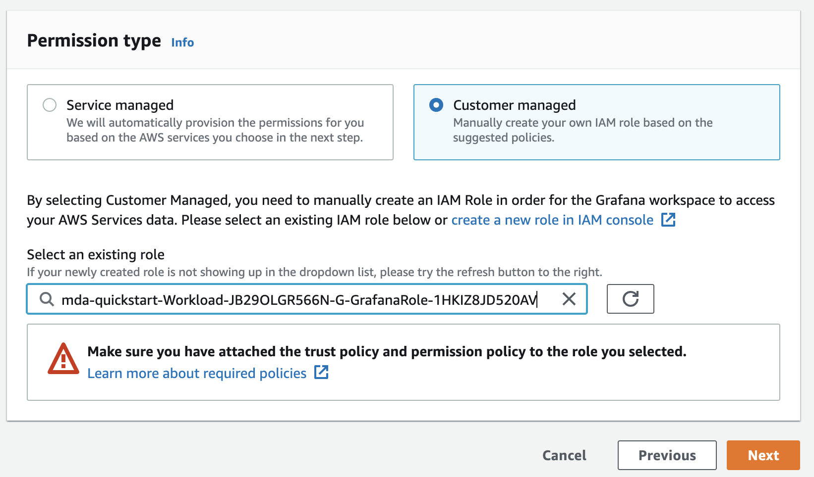

== Setting up Amazon Managed Grafana for Meter Data Analytics
This Quick Start includes a set of dashboards built in Amazon Managed Grafana. These dashboards leverage Amazon Athena to query data stored in the data lake, and depend on several of the optional datasets for full functionality.

As of Q4 2021, Amazon Managed Grafana only supports SAML and AWS SSO, for authentication. If your organization does not have SAML or AWS SSO set up, you should work with your AWS Admins to activate AWS SSO. Also as of this time there is no Cloudformation support for Amazon Managed Grafana, so these steps will walk you through:

* Creating a Grafana workspace
* Setting up AWS SSO for workspace access
* Setting up permissions for Grafana to access Athena
* Installing the dashboards and connecting to Athena

=== Creating a Workspace
Grafana workspaces are set up through the user interface. Navigate to https://console.aws.amazon.com/grafana. 


[#grafana_console]
.Grafana Console
[link=images/grafana-home.png]
image::../images/grafana-home.png[Grafana Home]

. Select *Create Workspace*.
+
:xrefstyle: short
[#create_workspace]
.Create Workspace
[link=/images/grafana-create-workspace.png]
image::../images/grafana-create-workspace.png[Grafana Create Workspace]


. Specify *Workspace Name* and optionally *Workspace Description*.
+
:xrefstyle: short
[#create_workspace]
.Create Workspace
[link=/images/grafana-details.png]
image::../images/grafana-details.png[Grafana Workspace Details]

. Select *Preferred Authentication Method (SSO or SAML)*.
+
:xrefstyle: short
[#auth_settings]
.Authentication Settings
[link=/images/grafana-authentication-settings.png]
image::../images/grafana-authentication-settings.png[Grafana Create Workspace]

. Select *Cusomter Managed IAM Policy* and choose the GrafanaRole created in CloudFormation.
+
:xrefstyle: short
[#select_iam_permissions]
.IAM Permissions
[link=/images/grafana-iam-permissions.png]


. Skip the service managed permissions as these won't apply.
+
:xrefstyle: short
[#service_managed_perms]
.Service Managed Permissions
[link=/images/grafana-service-managed-permissions.png]
image::../images/grafana-service-managed-permissions.png[Grafana Create Workspace]

Review your workspace details and then select *Create workspace*.

After the workspace finishes creating, you'll need to go in and select the SSO users and groups you wish to give access to Grafana. Once that is done, you should be able to log into your Grafana instance through the *Grafana workspace URL* provided in the console. 


=== Import the dashboards into Grafana

. Open the Step Functions console. Find the state machine with prefix *"MachineLearningPipelineModelTrainingStateMachine-"*.
. Open the state machine, and choose *Definition*. 
. Find the `HyperParameters` part, and modify the parameters or add more parameters. See https://docs.aws.amazon.com/sagemaker/latest/dg/deepar_hyperparameters.html[DeepAR Hyperparameters^].  
+
:xrefstyle: short
[#hyperparameters]
.Hyperparameters
[link=images/3_trainingpipeline_hyperparameters.png]
image::../images/3_trainingpipeline_hyperparameters.png[HyperParameters]

. Save the change to the state machine, and choose *Start execution*.

The configuration will be loaded from the DynamoDB table: *MachineLearningPipelineConfig**. The following parameters can be modified:

`Training_samples` specifies how many meter data will be used to train the model. The more meters are used, the more accurate the model will be and the longer the training will take.

A new unique `ModelName` and `ML_endpoint_name` will be generated.

```json
"Training_samples": 20,
"Data_start": "2013-01-01",
"Data_end": "2013-10-01",
"Forecast_period": 7
```
