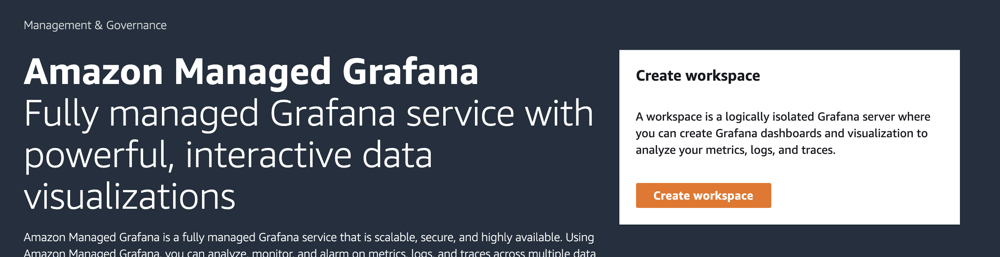
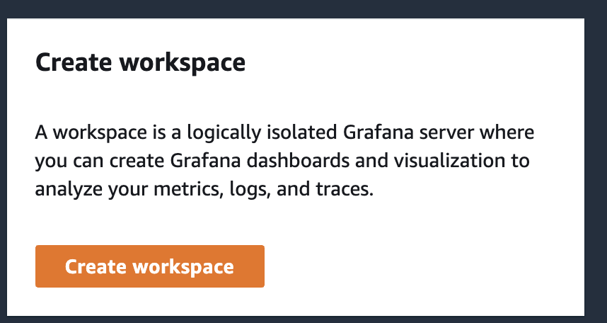
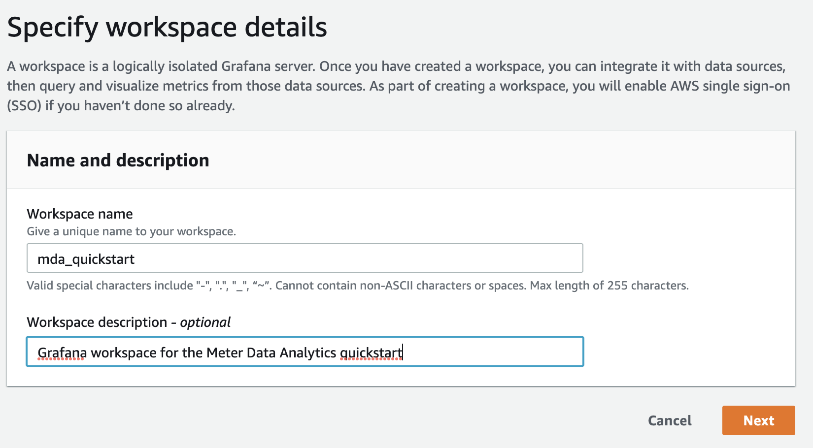
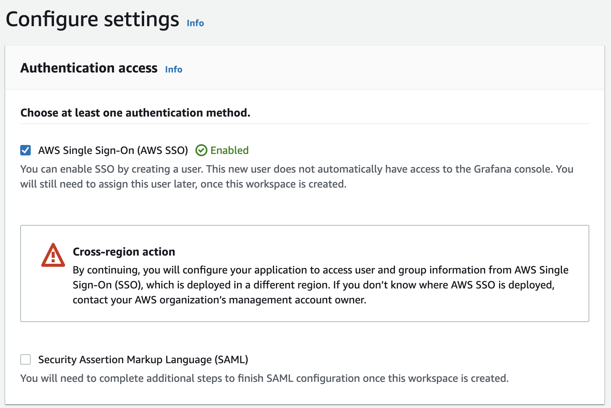
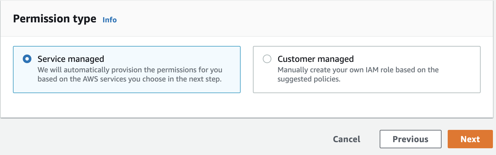
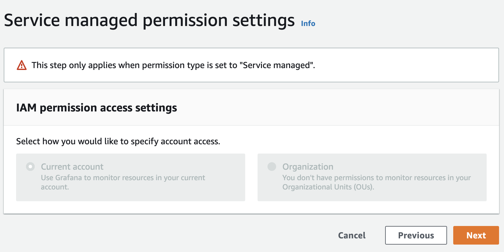
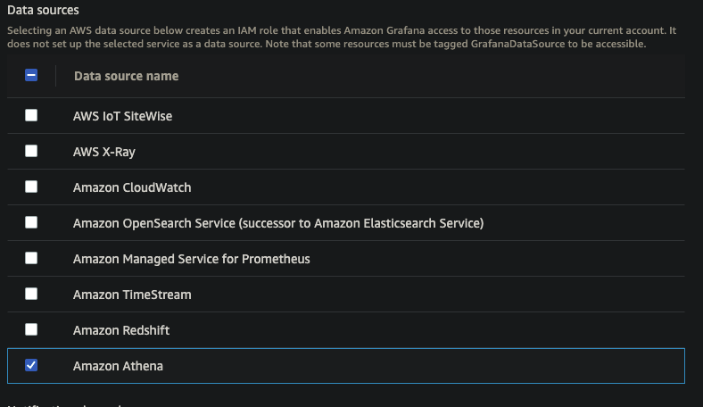
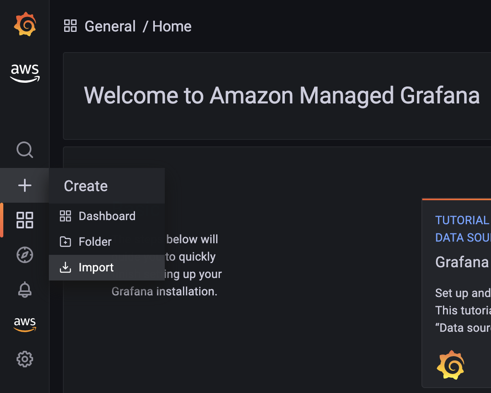
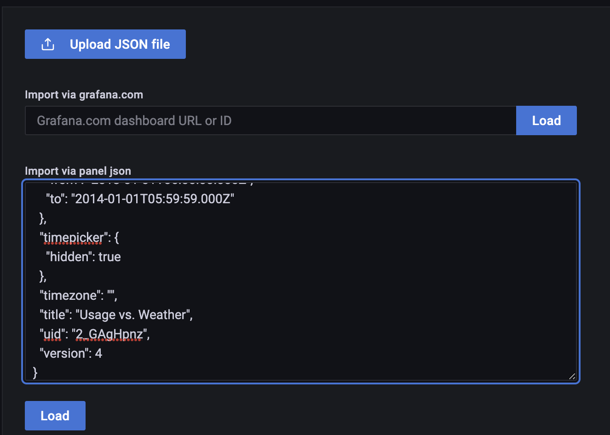

== Setting up Amazon Managed Grafana for Meter Data Analytics
This Quick Start includes a set of dashboards built in Amazon Managed Grafana. These dashboards leverage Amazon Athena to query data stored in the data lake, and depend on several of the optional datasets for full functionality.

As of January 2022, Amazon Managed Grafana only supports SAML and AWS SSO, for authentication. If your organization does not have SAML or AWS SSO set up, you should work with your AWS Admins to activate AWS SSO. Also as of this time there is no Cloudformation support for Amazon Managed Grafana, so these steps will walk you through:

* Creating a Grafana workspace
* Setting up AWS SSO for workspace access
* Setting up permissions for Grafana to access Athena
* Installing the dashboards and connecting to Athena

=== Creating a Workspace
Grafana workspaces are set up through the user interface. Navigate to https://console.aws.amazon.com/grafana. 

[#grafana_console]
.Grafana Console
[link=images/grafana-home.png]

. Select *Create Workspace*.
+
:xrefstyle: short
[#create_workspace]
.Create Workspace
[link=/images/grafana-create-workspace.png]

. Specify *Workspace Name* and optionally *Workspace Description*.
+
:xrefstyle: short
[#grafana_details]
.Grafana Details
[link=/images/grafana-details.png]

. Select *Preferred Authentication Method (SSO or SAML)*.
+
:xrefstyle: short
[#auth_settings]
.Authentication Settings
[link=/images/grafana-authentication-settings.png]

. Select *Service Managed IAM Policy*.
+
:xrefstyle: short
[#select_iam_permissions]
.IAM Permissions
[link=/images/grafana-service-managed-policy.png]

. Select *Current Account*.
+
:xrefstyle: short
[#service_managed_perms]
.Service Managed Permissions
[link=/images/grafana-service-managed-permissions.png]

. Select *Athena*.
+
:xrefstyle: short
[#data_sources]
.Data Sources
[link=/images/grafana-data-sources.png]

Review your workspace details and then select *Create workspace*.

=== Set up SSO or SAML
After the workspace finishes creating, you'll need to go in and select the SSO users and groups you wish to give access to Grafana. Once that is done, you should be able to log into your Grafana instance through the *Grafana workspace URL* provided in the console. 

=== Set up Athena Data Source in Grafana
Follow the AWS or Grafana docs for setting up Athena as a Data Source in Grafana:

. https://docs.aws.amazon.com/grafana/latest/userguide/AWS-Athena.html:[AWS Docs]
. https://grafana.com/docs/grafana/latest/datasources/add-a-data-source/[Grafana Docs]

=== Import the dashboards into Grafana

. Login into the Grafana console using either SAML or SSO.
. Select the *+* icon and go to import

+
:xrefstyle: short
[#home-import]
.Home Page Import
[link=images/grafana-home-import.png]

. Either copy in json from the /grafana/<dashboard-name>.json files in the repo or directly upload the json files

+
:xrefstyle: short
[#copy-json]
.Copy JSON
[link=images/grafana-copy-json.png]

After importing the tables, there may be some updates needed to match the configured data sources and glue database names chosen. If many errors pop up, go in and check the panels' data sources as well as the variables in the dashboard settings menus.
