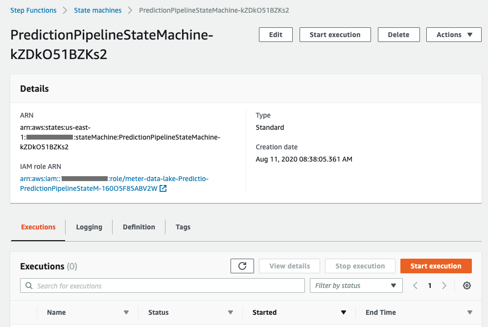
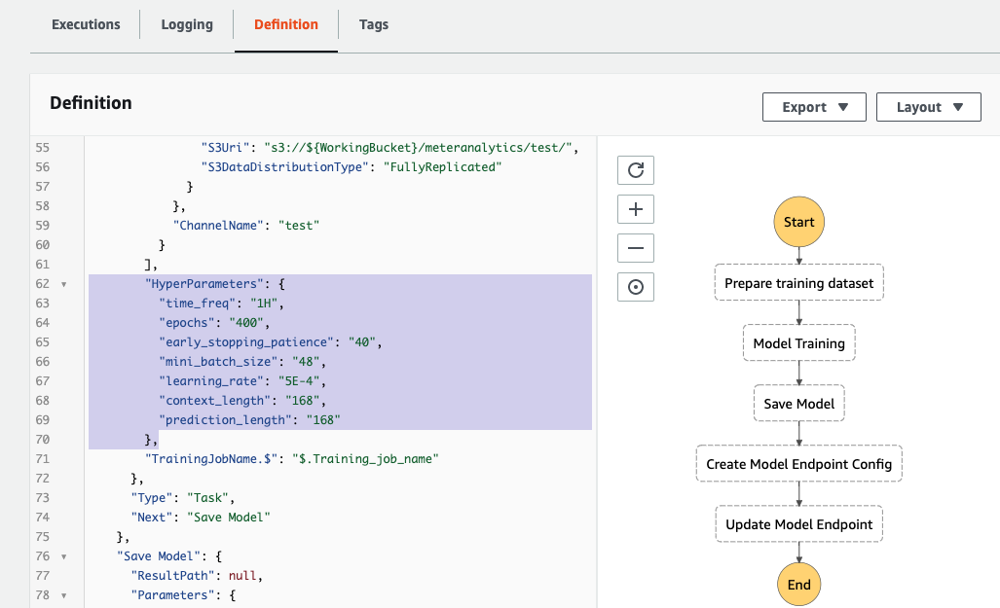

== How to retrain the model or use a custom model in the pipeline
This Quick Start deploys an ML pipeline, including a model-training workflow and a batch-processing workflow. This pipeline generates data that becomes the basis for forecasts and anomaly results. The initial deployment runs both workflows after ETL jobs are done.

After new data is added, you can rerun the whole AWS CloudFormation to reprocess the entire data and train a new model. Alternatively, you might rerun each part at a different schedule, as in these examples:

* Run the AWS Glue ETL workflow daily to process and format new data.
* Run the batch workflow weekly to generate forecast and anomaly for new data.
* Run the model-training workflow monthly to retrain the model to learn new customer-consumption patterns. 

You can also use a custom model for batch pipeline and forecast API.

=== Run the batch prediction pipeline
The batch pipeline is implemented by AWS Step Functions. 

. Open the Step Functions console. Find the state machine with the prefix *"MachineLearningPipelinePreCalculationStateMachine-"*.
+
:xrefstyle: short
[#step_function_console]
.Viewing state machines on the AWS Step Functions console
[link=images/1_batchpipeline.png]
image::../images/1_batchpipeline.png[AWS Step Functions console]

. Open the state machine, and choose *Start execution*.
+
:xrefstyle: short
[#batch_pipeline_execution]
.Batch pipeline execution
[link=images/2_batchpipeline_execution.png]


The input parameter can be found in the DynamoDB table *MachineLearningPipelineConfig**. You can specify the range of meters you want to process, and the date range of your data. Note that `Batch_size` should not exceed 100.

Adjust the following values in the DynamoDB table as needed:
```json

"Meter_start": 1,
"Meter_end": 50,
"Batch_size": 25,
"Data_start": "2013-01-01",
"Data_end": "2013-10-01",
"Forecast_period": 7

```


=== Retrain the model with different parameters

. Open the Step Functions console. Find the state machine with prefix *"MachineLearningPipelineModelTrainingStateMachine-"*.
. Open the state machine, and choose *Definition*. 
. Find the `HyperParameters` part, and modify the parameters or add more parameters. See https://docs.aws.amazon.com/sagemaker/latest/dg/deepar_hyperparameters.html[DeepAR Hyperparameters^].  
+
:xrefstyle: short
[#hyperparameters]
.Hyperparameters
[link=images/3_trainingpipeline_hyperparameters.png]


. Save the change to the state machine, and choose *Start execution*.

The configuration will be loaded from the DynamoDB table: *MachineLearningPipelineConfig**. The following parameters can be modified:

`Training_samples` specifies how many meter data will be used to train the model. The more meters are used, the more accurate the model will be and the longer the training will take.

A new unique `ModelName` and `ML_endpoint_name` will be generated.

```json
"Training_samples": 20,
"Data_start": "2013-01-01",
"Data_end": "2013-10-01",
"Forecast_period": 7
```
